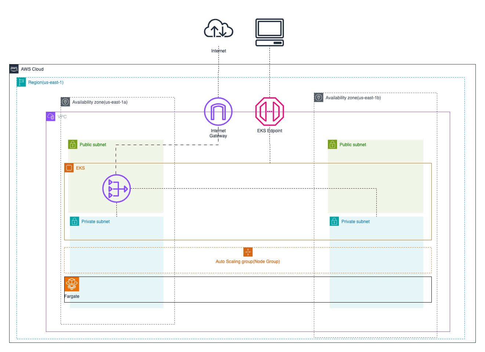

# Cluster EKS
Repositório para infra Kubernetes(AWS EKS) com Terraform


## Pré-requisitos
- Terraform
- AWS CLI
- Kubectl
- AWS Account
- AWS Access Key e Secret Key
- AWS S3 Bucket

## Instalação Local
1. Instalar o Terraform
```bash
wget https://releases.hashicorp.com/terraform/0.12.24/terraform_0.12.24_linux_amd64.zip
unzip terraform_0.12.24_linux_amd64.zip
sudo mv terraform /usr/local/bin/
```

2. Instalar o AWS CLI
```bash
sudo apt install awscli
```

3. Instalar o Kubectl
```bash
curl -o kubectl https://amazon-eks.s3.us-west-2.amazonaws.com/1.15.10/2020-02-22/bin/linux/amd64/kubectl
chmod +x ./kubectl
sudo mv kubectl /usr/local/bin/
```

4. Configurar o AWS CLI
```bash
aws configure
```

5. Clonar o repositório
```bash
git clone 
```

6. Acessar o diretório
```bash
cd cluster-eks-tf
```

7. Inicializar o Terraform
```bash
terraform init
```

8. Criar o plano de execução
```bash
terraform plan
```

9. Aplicar o plano de execução
```bash
terraform apply
```

10. Configurar o Kubectl
```bash
aws eks --region $(terraform output region) update-kubeconfig --name $(terraform output cluster_name)
```

11. Testar o cluster
```bash
kubectl get nodes
```

12. Destruir o cluster
```bash
terraform destroy
```



